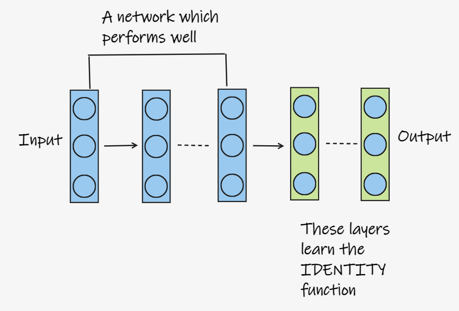
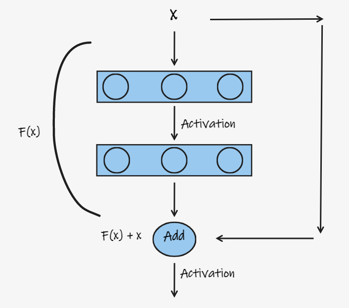
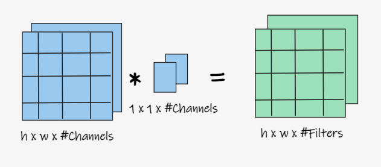
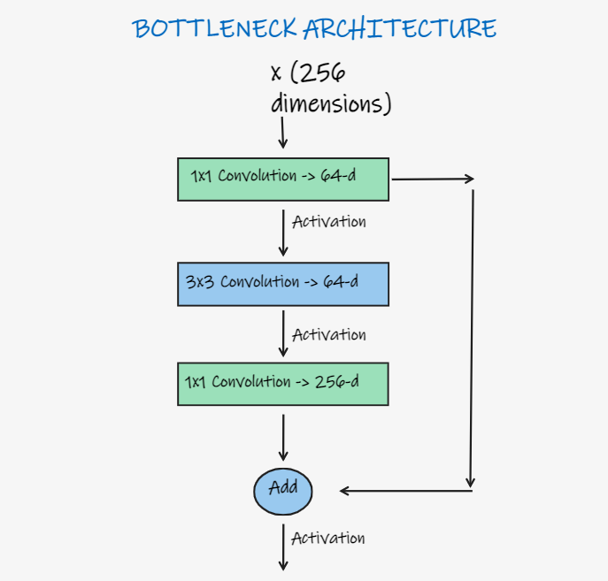

# Deep Residual Networks: Notes and Implementation 
This readme contains notes and my intuitions of the paper "Deep Residual Learning for Image Recognition" by Kaiming He, Xiangyu Zhang, Shaoqing Ren, and Jian Sun of Microsoft Research.

This link redirects to the [original paper](https://arxiv.org/pdf/1512.03385.pdf). 

## Introduction
The main aim of this paper is to ease the training of neural networks, which are substantially deeper, even going up to 1000 layers. 

Say there is a network, which performs quite well on the chosen performance measure. If we add a few more layers at the end of that network, which represent the Identity function(f(x)=x). So, the performance of this new network should not differ much from the original network as the layers added give out the same output as the input fed to them. Hence a deeper model should have training error no greater than its shallower counterpart.  Figure 1 shows this representation.  

Fig 1. Visual representation of the layers

But, do we just train the network and hope the last few layers learn the identity function? Well, no. The authors of the paper go on to introduce a *deep residual learning* framework. 

Let us first answer an important question.

## Does stacking more layers imply better results?

Neural networks, especially the deeper ones have often fallen prey to the vanishing/exploding gradients problem, in which the gradients in the deeper layers either become too close to zero(little to no updates in weights) or become too large(large updates in weights), thus hampering performance.

There is a solution to this problem and the trick lies in normalizing the inputs to the layers. This is mostly taken care by the performing Batch Normalization after taking the activations of one layer, before passing them onto the next.

## The Degradation Problem
The authors also look to address the issue of degradation. As the depth of the network increases, the accuracy gets saturated and then degrades rapidly. This however, is quite different from overfitting. 

Overfitting occurs when our network tends to "learn" the training data, and hence, does brilliantly well on the training set, but when it comes to the test set, the error just shoots up. 

Degradation, however is a different issue. It refers to the drop in performance, or the increase in error in deeper network, as compared to shallower ones. The two graphs in the figure below helps distinguish between overfitting and degradation. 

Fig 2. Overfitting vs Degradation

This problem of degradation implies that not all networks are similarly easy to optimize. Now, let's go back to the first idea of adding layers which map the identity function. If the added layers can
be constructed as identity mappings, a deeper model should
have training error no greater than its shallower counterpart. And thus, here comes the importance of the Deep Residual Framework, which helps us implement this. 

Here, another important fact comes up: It is easier for models or layers to learn zero mappings than identity mappings. The reason? Well, it lies with the random initialization of weights, which are normally disributed around zero(0), which is the mean. This makes it easier for the model to learn zero mappings. 

## The Deep Residual Framework

As mentioned earlier, the deep residual learning framework allows the layers to learn the identity function. Say, the layers need to learn the function H(x), which is evidently defined by H(x) = x ideally. The layers learn a certain function, which is described by F(x). The x which is passed as input, is then added to F(x), thus making it F(x)+x before passing it onto the activation function, as shown in Figure 2. 

Fig 3. The blocks which implement residual learning

Thus, H(x) comes out to be: H(x) = F(x) + x. F(x), which is generally referred to as the residue is mathematically represented as F(x) = H(x) - x. 

Shortuct connections or Skip Connections are used to achieve this. In this case, these shortcut connections are used to perform the identity mapping. As evident from the figure, no extra parameter is added and thus the computational complexity isn't affected either. This network can be trained using Stochastic Gradient Descent with backpropagation. 

## Architecture of the full network

Fig 4. ResNet: Architecture

The architecture of the complete network is given in the above figure. As mentioned earlier, a lot of experimentation has been done by the authors and they propose the architectures, including the residual blocks, for the whole network with 18, 34, 50, 101 and 152 layers.

One interesting point to note here are the bottleneck blocks, which start and end with 1X1 convolutions in deeper ResNets with 50, 101 and 152 layers. These bottleneck blocks are a variant of the residual blocks and are special due to the presence of these 1X1 convolution layers. 

## 1X1 Convolutions
1X1 convolutions have a special intuition: they are mainly used to increase or decrease the size of the input. 1X1 convolutions map each input pixel and its corresponding channels to an output pixel. 

Fig 5. 1X1 Convolutions

So, it does not change the height or width of the input. But, depending on the number of filters, it changes the number of channels. This can be used to increase or decrease the number of channels. The above figure shows the effect of 1X1 convolutions. 

## Bottleneck Blocks
Bottleneck blocks take advantage of 1X1 Convolutions. Quoting from the original paper, which is quite self explanatory: 

>Because of concerns on the training time that we can afford, we modify the building block as a bottleneck design. For each residual function F, we use a stack of 3 layers instead of 2. The three layers
are 1×1, 3×3, and 1×1 convolutions, where the 1×1 layers are responsible for reducing and then increasing (restoring) dimensions, leaving the 3×3 layer a bottleneck with smaller input/output dimensions. 

Fig 6. Bottleneck Architecture

The figure above shows a bottleneck block. Deeper non-bottleneck ResNets show an increase in performance due to the increased depth, but they won't be as economical as the bottleneck blocks. 

## Results
This paper was one of the groundbreaking papers which set a lot of standards in the field of computer vision. As for results, it has a lot of accolades, one of which is winning the ImageNet Competition ILSVRC 2015 with an error of 3.57% on the test set. 

It also managed to overfit the CIFAR-10 dataset. They also obtain a 28% relative improvement on the COCO object detection dataset.
